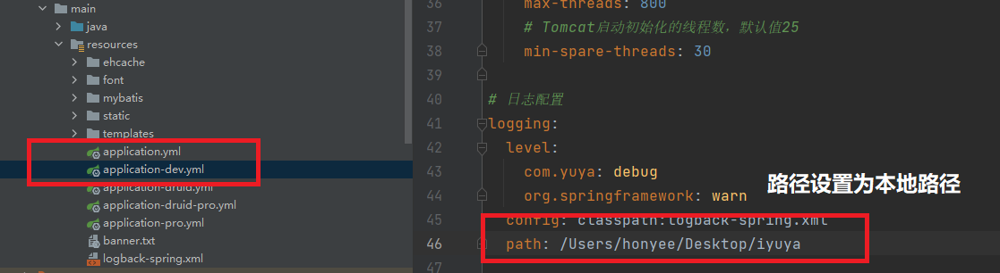
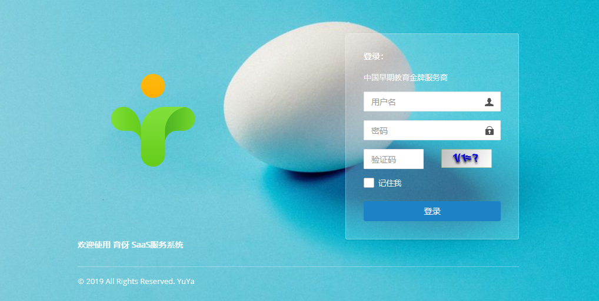
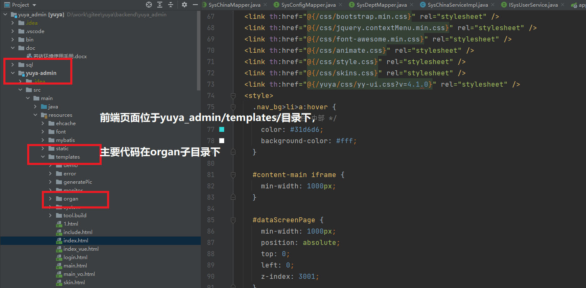

育伢后台管理系统

## 一、项目结构

育伢后台管理系统是基于若依开源项目，系统基本框架和代码结构都类似于若依项目。
 
[若依服务器文档](http://doc.ruoyi.vip/ruoyi/)

## 二、yuya后台管理系统的编译和运行(IDEA环境下）

* step1： 用代码管理工具从服务器下载代码到本地。（需要安装JDK到本地，并设置路径到开发工具。本项目的JDK使用JDK8）

* step2： 在idea中打开yuya_admin目录，编译运行代码

如果出现下面图片，则育伢编译成功

如果出现编译错误，查看错误信息，可能是日志地址配置问题，检查配置文件中的日志地址，将路径配置为本机目录即可。

* step3： 本地启动项目：http://localhost:8077

启动育伢管理后台。

## 三、前端开发环境

前端开发基于thymeleaf模板框架，

[thymeleaf官方](https://www.thymeleaf.org/documentation.html)

[springboot + thymeleaf的一个简单例子](https://blog.csdn.net/nginxs/article/details/78006195?utm_medium=distribute.pc_relevant.none-task-blog-2~default~baidujs_baidulandingword~default-4.essearch_pc_relevant&spm=1001.2101.3001.4242)

代码位置：

