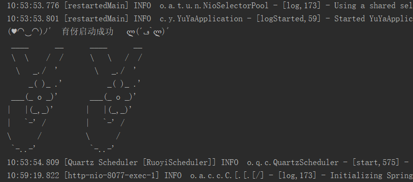
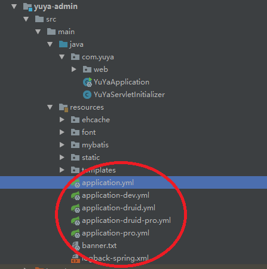

## 若依服务器文档信息
 
[若依服务器文档](http://doc.ruoyi.vip/ruoyi/)

## yuya后台管理系统的编译和运行

step1： 用代码管理工具从服务器下载代码到本地。

step2： 在idea中打开yuya_admin目录，编译代码

如果出现下面图片，则育伢编译成功

step3： 本地打开http://localhost:8077,育伢后台启动成功。

## 项目配置：

yuya_admin/src/resources目录下的yml文件：

## 项目结构

